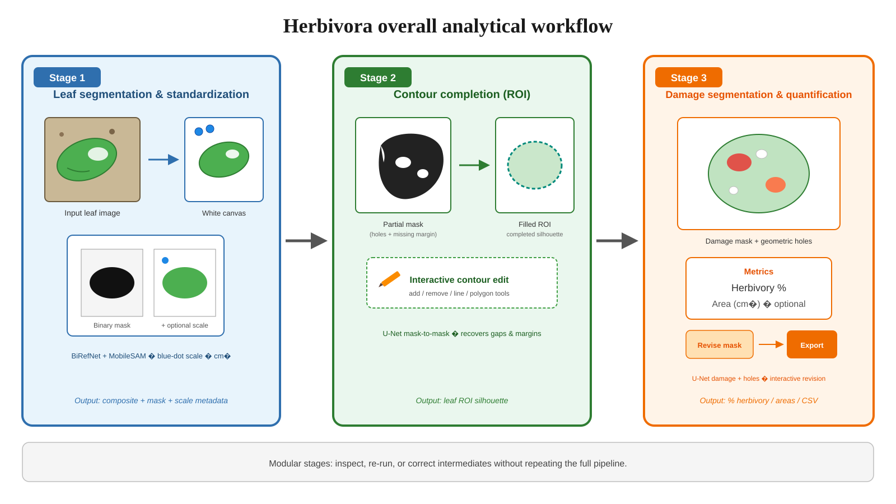

<p align="center">
  
</p>

<h1 align="center">Herbivora</h1>

<p align="center">
  <strong>Desktop software for quantifying leaf herbivory damage from photographs</strong>
</p>

<p align="center">
  <a href="https://doi.org/10.5281/zenodo.22120799"></a>
  <a href="LICENSE"></a>
  <a href="https://github.com/mariosandovalmx/Herbivora/releases/latest"></a>
  
  
  <a href="https://huggingface.co/mariosandovalmx/Herbivora"></a>
</p>

<p align="center">
  <a href="https://github.com/mariosandovalmx/Herbivora/releases">Download</a> ·
  <a href="USER_GUIDE.md">User guide</a> ·
  <a href="CHANGELOG.md">Changelog</a> ·
  <a href="https://doi.org/10.5281/zenodo.22120799">Zenodo archive</a> ·
  <a href="CITATION.cff">Citation</a>
</p>

---

## Overview

**Herbivora** is a desktop GUI for plant ecologists and related researchers who need reproducible estimates of leaf area removed or damaged by herbivores. Starting from leaf photographs, the app combines deep-learning segmentation, morphology-aware contour reconstruction, and interactive damage editing into a single workflow.

<p align="center">
  
</p>

| Stage | What it does |
|:------|:-------------|
| **1. Segmentation** | Isolates leaves from the background (BiRefNet + MobileSAM, Intact Leaves, or Interactive) |
| **2. Contour / ROI** | Reconstructs the expected leaf silhouette with UNET Shape specialists and optional manual editing |
| **3. Analysis** | Quantifies herbivory with a damage U-Net, including scraped tissue and frass-aware handling |

---

## Key metrics

| | |
|:--|:--|
| **Current version** | See [`VERSION`](VERSION) · [latest release](https://github.com/mariosandovalmx/Herbivora/releases/latest) |
| **Archived release** | [v1.4.1 on Zenodo](https://doi.org/10.5281/zenodo.22120799) |
| **Platforms** | Windows 10/11 · macOS 11+ · Linux |
| **Pipeline stages** | 3 (Segmentation → Contour → Analysis) |
| **Contour leaf types** | Auto, Entire/smooth, Serrated, Lobed, Compound (4 specialist U-Nets) |
| **Model weights** | ~226 MB (downloaded on first install / Check installation) |
| **Install disk space** | ~3–6 GB (environment + weights; CUDA needs more) |
| **Acceleration** | Optional NVIDIA CUDA (Windows/Linux) · Apple Metal / MPS (macOS) · CPU fallback |
| **Primary outputs** | `results.csv` + overlay images under `{output}/analyzed/` |
| **License** | [PolyForm Noncommercial 1.0.0](LICENSE) (research & education) |

---

## Features

- **One GUI for the full pipeline** — project setup, segmentation, contour reconstruction, and damage analysis in four tabs
- **Leaf-type contour specialists** — choose Auto or Entire / Serrated / Lobed / Compound so UNET Shape matches leaf morphology
- **Multiple leaves per photo** — optional BiRefNet + MobileSAM split into `{photo}_leaf_N` units (one CSV row each after Analysis)
- **Interactive editors** — refine contour and damage masks with Add / Remove / Line / Polygon tools
- **Analysis extras** — superficial scraped-tissue detection, improved frass handling in damage zones, semi-transparent overlays
- **Installers** — Windows Setup.exe and macOS DMG; source installers for advanced users
- **Open model weights** — Herbivora U-Nets on [`mariosandovalmx/Herbivora`](https://huggingface.co/mariosandovalmx/Herbivora)

---

## Quick start

1. Download from **[Releases](https://github.com/mariosandovalmx/Herbivora/releases)**:
   - **Windows:** `Herbivora-Setup-vX.Y.Z.exe` (or Source ZIP + `Install_Herbivora.bat`)
   - **macOS:** `Herbivora-vX.Y.Z.dmg` (or Source ZIP + `Install_Herbivora.command`)
2. Install:
   - **Windows:** run Setup and follow the wizard (GPU auto-detect recommended).
   - **macOS:** open the DMG, drag the **Herbivora** leaf icon to **Applications**, then launch from Applications (not from the DMG). On first open, approve under **System Settings → Privacy & Security → Open Anyway** if macOS shows an unverified-developer warning.
3. Complete first-time setup (downloads PyTorch + models).
4. Open **Herbivora** and run **Check installation** on the Project tab.

**Full steps for every OS:** **[USER_GUIDE.md](USER_GUIDE.md)** · short reference: **[INSTALL.md](INSTALL.md)**.

You do **not** need to install Python manually on Windows when using the recommended installer.

---

## Typical workflow

1. **Project** — set input / output folders; run **Check installation**. Optionally enable **Multiple leaves per photo**.
2. **Segmentation** — BiRefNet + MobileSAM (recommended), Intact Leaves, or Interactive.
3. **Contour / ROI** — pick leaf type (or Auto), run UNET Shape; optionally **Edit Contour**.
4. **Analysis** — run the damage U-Net; optionally **Edit Damage**.

Results are written to `{output}/analyzed/` (`results.csv` + overlays).

> **Multi-leaf tip:** leaves in the same photo should not touch or overlap, or they may merge into one component.

---

## Requirements

- ~3–6 GB free disk for the environment and weights
- Internet for the first install
- Optional: NVIDIA GPU (Windows/Linux). On Mac, Metal (MPS) is used when available

Weights downloaded by the installer or **Check installation**:

- Herbivora U-Nets: [`mariosandovalmx/Herbivora`](https://huggingface.co/mariosandovalmx/Herbivora)
- MobileSAM: [Ultralytics assets](https://github.com/ultralytics/assets/releases) (third-party, Apache-2.0)
- BiRefNet_lite: loaded from Hugging Face on first use

---

## Project layout

```
Herbivora/
├── gui/                      # CustomTkinter desktop application
├── packaging/                # Bootstrap installer, Setup/DMG builders
├── models/                   # Weights (downloaded; git-ignored)
├── assets/                   # App icon and schematic artwork
├── Install_Herbivora.bat      # Windows one-click installer
├── Install_Herbivora.command  # Source-install fallback (macOS/Linux)
├── USER_GUIDE.md
├── CITATION.cff
└── LICENSE
```

---

## Citation

**If you use Herbivora (or its trained weights) in a publication, thesis, or presentation, you must cite it** under the Herbivora noncommercial license.

**APA**

> Sandoval, M. (2026). *Herbivora* (v1.4.1). Zenodo. https://doi.org/10.5281/zenodo.22120799

**BibTeX**

```bibtex
@software{sandoval_herbivora_2026,
  author       = {Sandoval, Mario},
  title        = {Herbivora},
  version      = {1.4.1},
  year         = {2026},
  publisher    = {Zenodo},
  doi          = {10.5281/zenodo.22120799},
  url          = {https://doi.org/10.5281/zenodo.22120799},
  orcid        = {0000-0002-8536-6006}
}
```

| Identifier | Link |
|:-----------|:-----|
| **This version DOI** | [10.5281/zenodo.22120799](https://doi.org/10.5281/zenodo.22120799) |
| **Concept DOI** (all versions) | [10.5281/zenodo.22120798](https://doi.org/10.5281/zenodo.22120798) |
| **Machine-readable citation** | [`CITATION.cff`](CITATION.cff) |
| **GitHub** | [mariosandovalmx/Herbivora](https://github.com/mariosandovalmx/Herbivora) |
| **Model card** | [huggingface.co/mariosandovalmx/Herbivora](https://huggingface.co/mariosandovalmx/Herbivora) |

GitHub “Cite this repository” also reads from `CITATION.cff`.

---

## License

Herbivora **software** and **Herbivora-trained U-Net weights** are licensed under the
**[PolyForm Noncommercial License 1.0.0](LICENSE)** for **noncommercial research and education** only.

- Commercial use requires **prior written permission** from the copyright holder.
- Attribution / citation is **required** when the software or weights are used in scholarly or public work (see [Citation](#citation)).

Third-party components (e.g. MobileSAM, BiRefNet) remain under their own licenses — see [`THIRD_PARTY_NOTICES.md`](THIRD_PARTY_NOTICES.md).

Windows and macOS installers show the full license agreement and require acceptance before install.

---

## Documentation

| Document | Purpose |
|:---------|:--------|
| [USER_GUIDE.md](USER_GUIDE.md) | End-user install and first analysis |
| [INSTALL.md](INSTALL.md) | Short install reference and advanced notes |
| [CHANGELOG.md](CHANGELOG.md) | Version history |
| [THIRD_PARTY_NOTICES.md](THIRD_PARTY_NOTICES.md) | Third-party licenses |
| [packaging/README.md](packaging/README.md) | Installer / DMG build notes |
